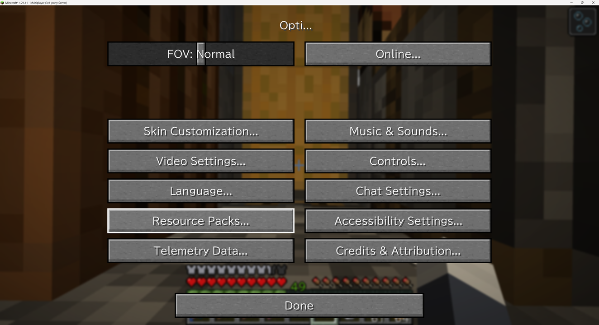
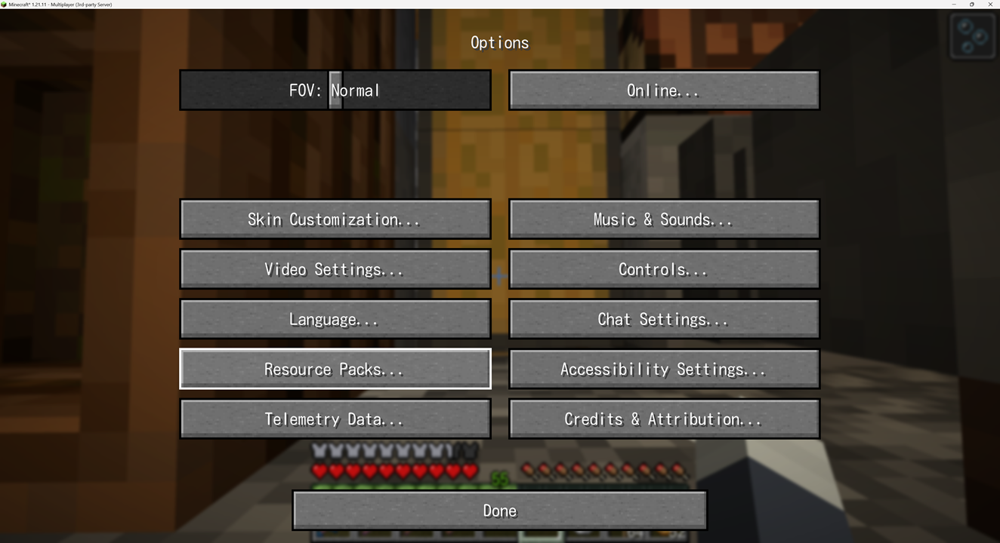
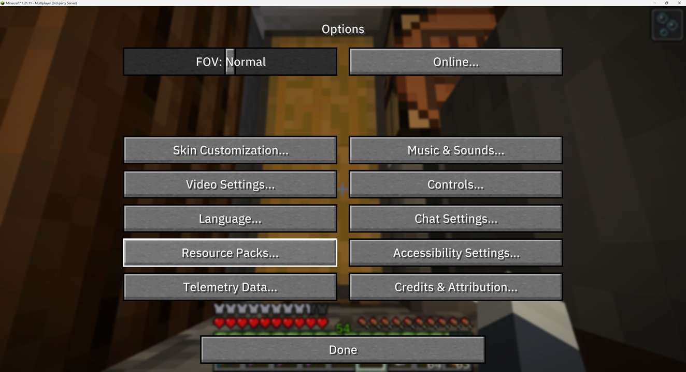
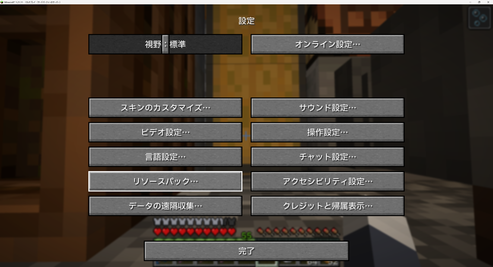

# Minecraft Smooth Font

The Minecraft resource pack, ``Smooth Font,'' replaces the text with a smooth font.

This resource pack makes text easier to read, especially in Japanese.

## Latest Version

1.1.0

## For Java Edition (26.1/26.1.1 or later) users

1.) Download the resource pack from the `1.1.0` directory.

2.) Place it in `C:\Users\<Username>\AppData\Roaming.minecraft\resourcepacks`

## For Java Edition (1.21.9/1.21.10/1.21.11) users

Try version 1.0.4, as these files are stored in the `1.0.4` directory.

### How to Create a Resource Pack

```shell
% git clone https://github.com/cvsync/SmoothFont

% cd SmoothFont

% /bin/sh build.sh

% ls 1.1.0/
SmoothFont-bizud.zip    SmoothFont-kosugi.zip   SmoothFont-mplus.zip    SmoothFont-plexsans.zip
```

## Smooth Fonts Images

### モリサワ BIZ UD ゴシック (Morisawa BIZ UD Gothic)

SIL Open Font License 1.1

[モリサワ BIZ UD P ゴシック Regular (Morisawa BIZ UD P Gothic Regular)](https://github.com/googlefonts/morisawa-biz-ud-gothic/)




### 小杉丸 (Kosugi Maru)

Apache License 2.0

[小杉丸 (MOTOYA Kosugi Maru)](https://github.com/googlefonts/kosugi-maru)




### M+ FONTS

SIL Open Font License 1.1

[M PLUS 1 Medium](https://mplusfonts.github.io/)


### IBM Plex&reg; typeface

SIL Open Font License 1.1

[IBM Plex Sans JP](https://github.com/IBM/plex/)



